**项目简介：**  
本项目基于主流的前后端分离架构，采用 **SpringBoot + Vue 技术栈**，配套 **MySQL 数据库**，适用于毕业设计与课题实训开发。  
本人已整理了超 **4000 多套毕业设计源码+论文+开题报告+PPT...**，涵盖 **Java、SpringBoot、Vue、SSM、uni-app 小程序、PHP、Android** 等方向，支持功能修改定制与论文服务。  
**团队提供以下服务：**  
- 项目代码修改与调试  
- 数据库配置与远程协助  
- 论文定制与修改  
**获取更多的4000多套源码或SQL文件请联系：**  
- QQ：3906443360 微信：BesheHelp

## springboot035学科竞赛管理

**项目简介：**  
本项目基于主流的前后端分离架构，采用 **SpringBoot + Vue 技术栈**，配套 **MySQL 数据库**，适用于毕业设计与课题实训开发。  
本人已整理了超 **4000 多套毕业设计源码+论文+开题报告+PPT...**，涵盖 **Java、SpringBoot、Vue、SSM、uni-app 小程序、PHP、Android** 等方向，支持功能修改定制与论文服务。  
**团队提供以下服务：**  
- 项目代码修改与调试  
- 数据库配置与远程协助  
- 论文定制与修改  
**获取更多的4000多套源码或SQL文件请联系：**  
- QQ：3906443360 微信：BesheHelp**

# 系统实现与系统测试

# 5 系统的实现

5.1学生功能模块的实现

学生进入本系统可查看系统信息，系统主界面展示如图5-1所示。

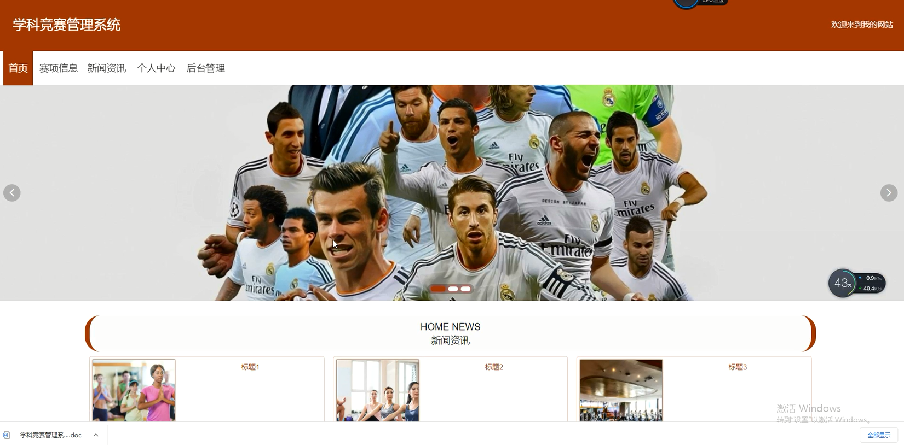

图5-1系统主界面图

5.1.1 学生注册界面

没有账号的学生用户可进行注册操作，学生注册界面展示如图5-2所示。

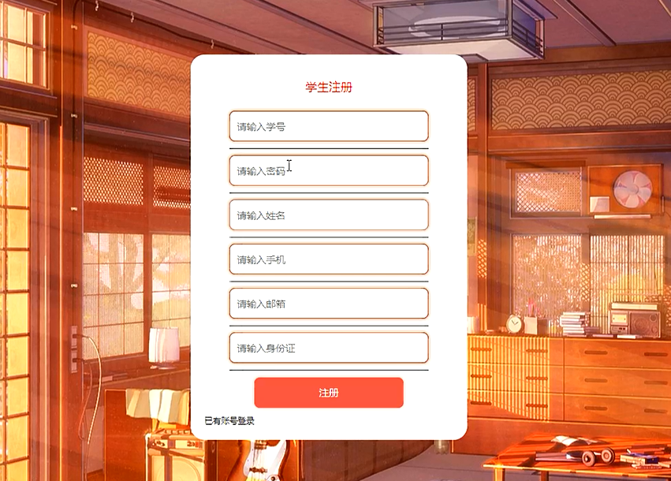

图5-2 学生注册界面图

5.1.2 学生登录界面

学生在登录时需输入正确的登录用户名和密码，系统会以登录用户名、密码为参数进行登录信息的验证，信息正确则登录成功，反之登录失败，学生登录界面展示如图5-2所示。

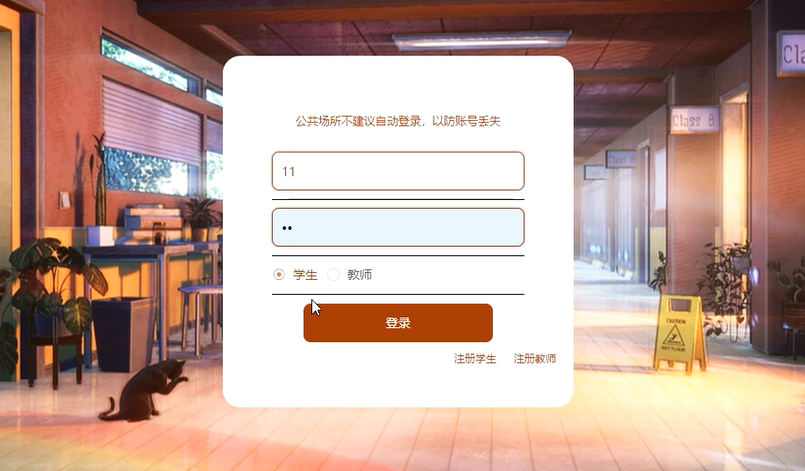

图5-3   学生登录界面图

5.1.3 赛项详情界面

学生可选择赛项查看详情信息，登录后可进行报名操作，赛项详情界面展示如图5-4所示，报名界面展示如图5-5所示。

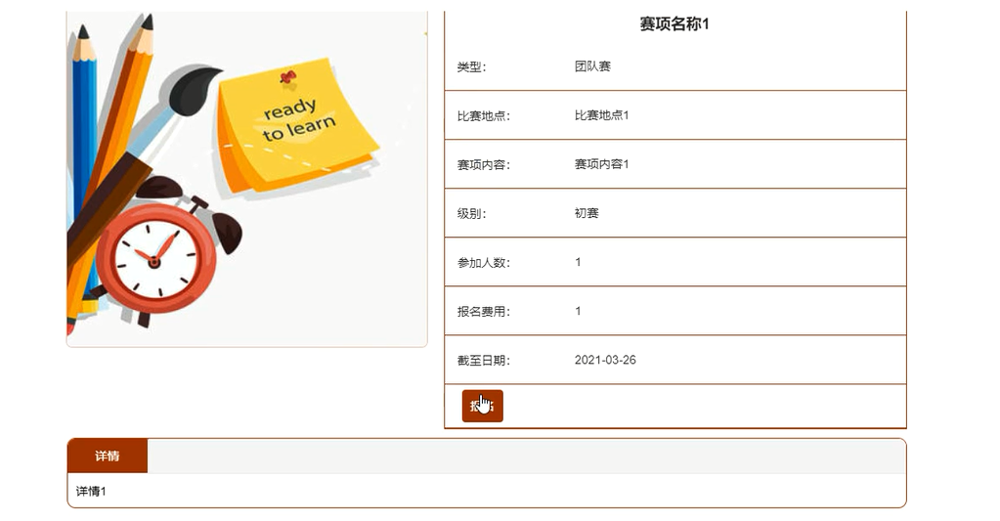

图5-4 赛项详情界面图

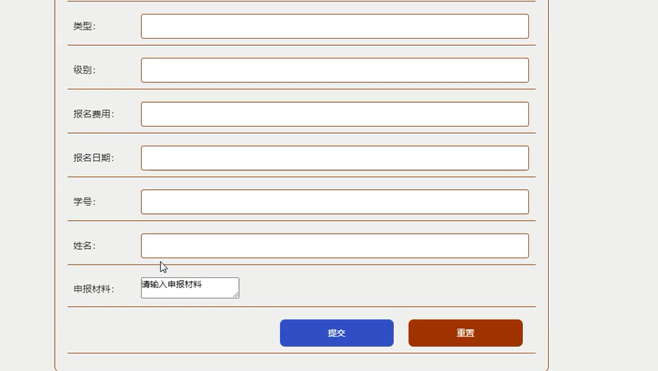

图5-5  报名界面图

5.1.4 个人中心界面

学生可对个人信息进行修改，个人中心界面展示如图5-6所示。

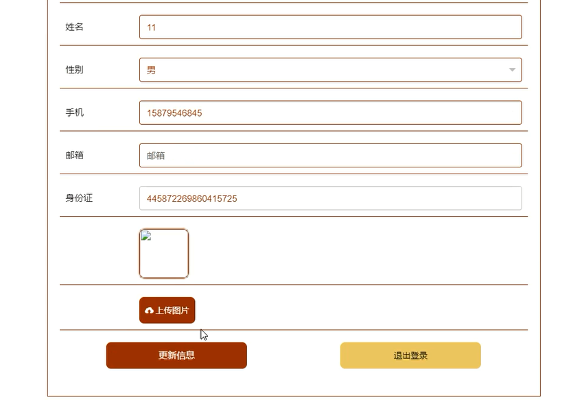

图5-6  个人中心界面图

5.2管理员功能模块的实现

5.2.1 管理员登录界面

管理员要想进入后台进行管理操作，必须登录系统后台，管理员登录界面展示如图5-7所示。

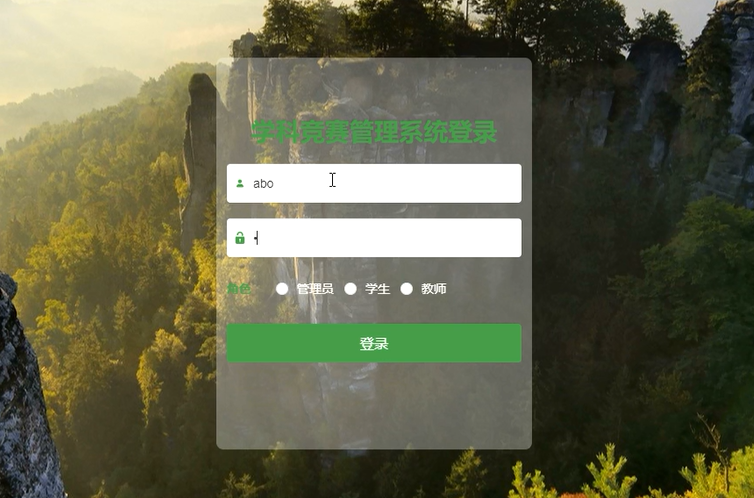

图5-7 管理员登录界面图

5.2.2 学生管理界面

管理在学生管理界面可查看所有学生信息，并可对其进行修改和删除操作，同时也可添加学生信息，学生管理界面展示如图5-8所示。

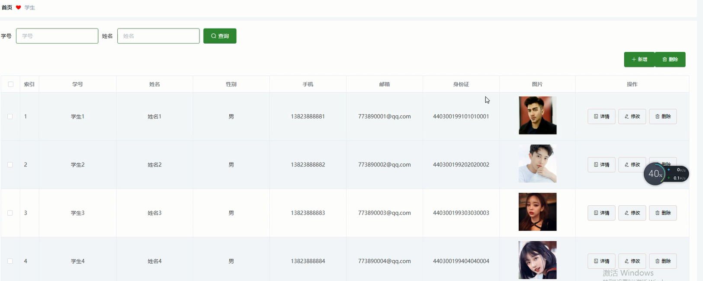

图5-8 学生管理界面图

5.2.3 教师管理界面

管理员可增删改查教师信息，教师管理界面展示如图5-9所示。

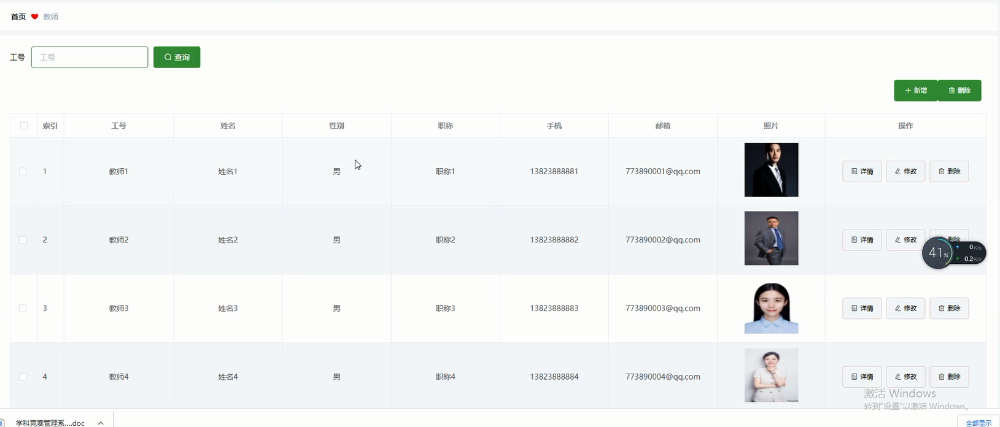

图5-9 教师管理界面图

5.2.4 赛项信息管理界面

管理员可增删改查赛项信息，赛项信息管理界面如图5-10所示。

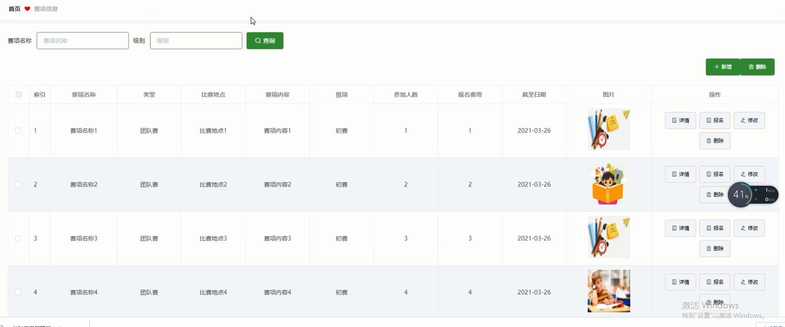

图5-10  赛项信息管理界面图

5.2.5 赛项报名管理界面

管理员可查看所有赛项报名信息，并可对其进行审核、修改和删除操作，赛项报名管理界面展示如图5-11所示。

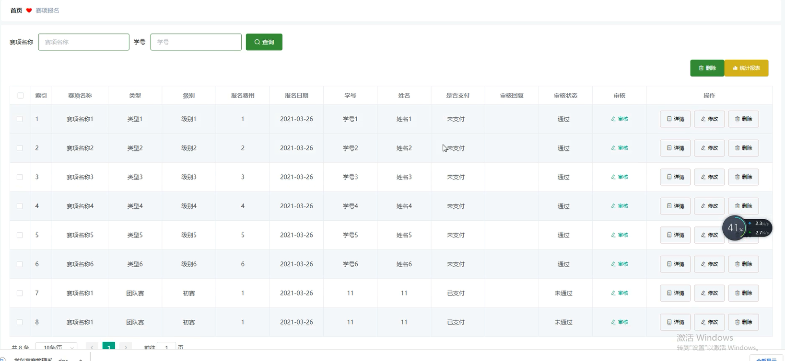

图5-11 赛项报名管理界面图

5.2.6 奖项统计管理界面

管理员可增删改查奖项统计信息，奖项统计管理界面展示如图5-12所示。

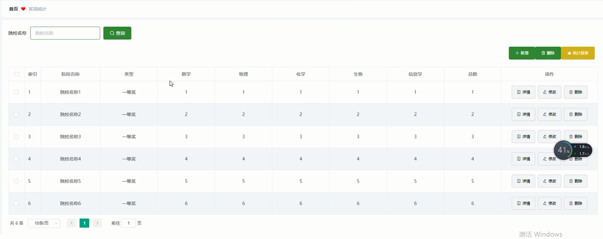

图5-12 奖项统计管理界面图

